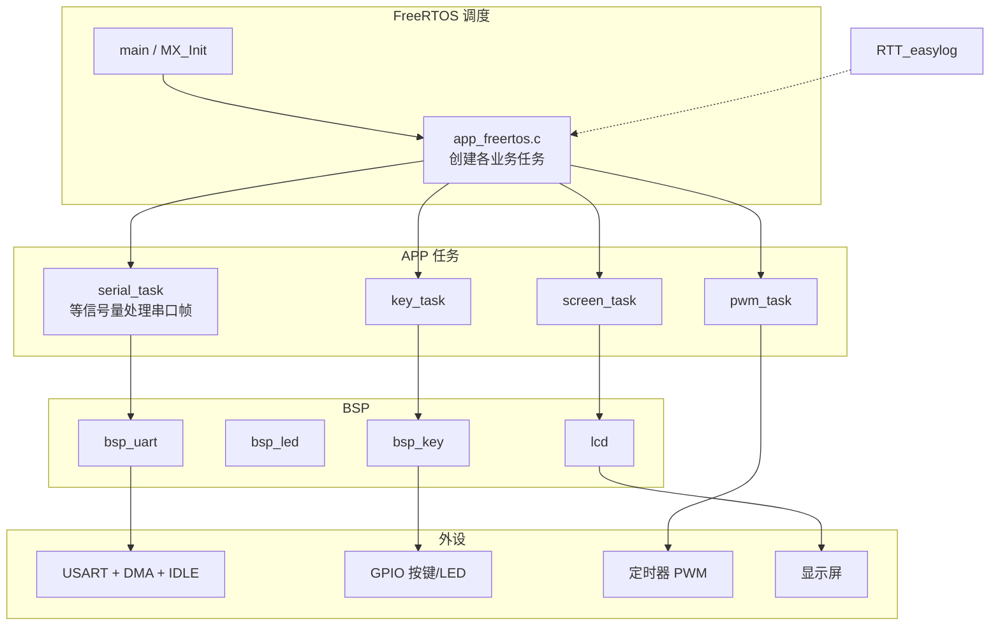
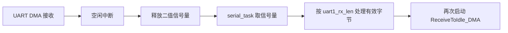

# Stm32g431_Freertos_Lab

STM32G431 + **FreeRTOS**（CMSIS-RTOS）实验工程：按键 / PWM / 屏幕 / 串口任务，重点练习 **UART 空闲中断 + DMA + 信号量** 收包方案。

CubeMX 工程：`freertos-test.ioc`；目标芯片 STM32G431。

## 系统架构图



## 串口收包框图



## 目录说明

| 路径 | 说明 |
|------|------|
| `Core/` | Cube 生成：main、USART、DMA、TIM、FreeRTOS 入口 |
| `APP/` | 业务任务：`key_task` / `pwm_task` / `screen_task` / `serial_task` |
| `BSP/` | 板级：`bsp_key` / `bsp_led` / `bsp_uart` / `lcd` |
| `RTT_easylog/` | RTT 日志 |
| `MDK-ARM/` / `EWARM/` / `cmake/` | 多工具链工程 |
| `Mytext.md` | 串口 DMA 方案学习笔记 |

## 远程

```text
origin → https://github.com/linxi27667/Stm32g431_Freertos_Lab.git
```

本地常见路径：`E:\MCU\lanqiaobei\freertos-test`（若有副本目录，一并改 remote）
